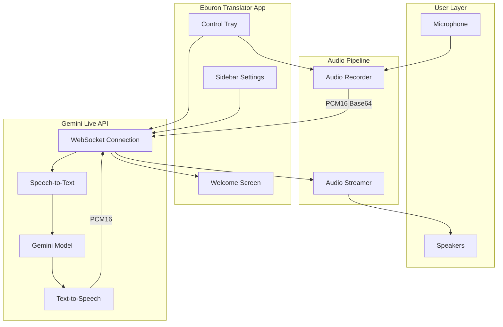
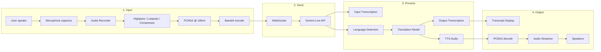
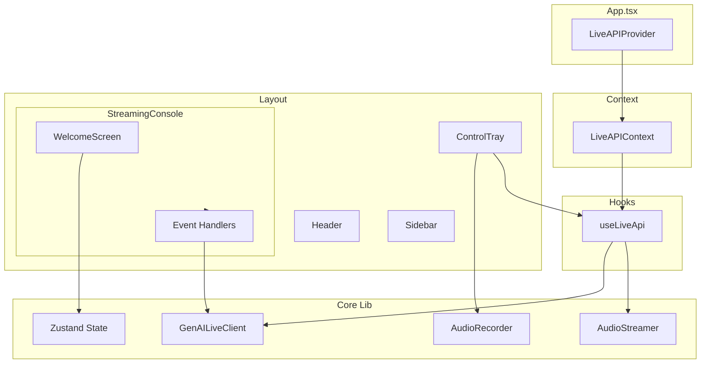
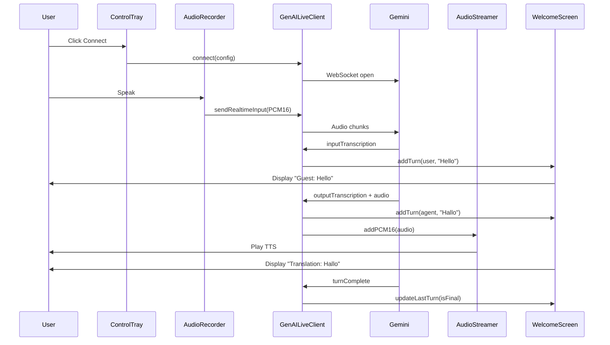

# Eburon Translator

Real-time bidirectional speech translator powered by **Google Gemini Live API**. Acts as a live interpreter between two speakers (Guest and Staff) with instant transcription, translation, and text-to-speech playback.

---

## Overview

Eburon Translator enables natural, real-time conversation across language barriers. One person speaks (Guest), the system transcribes, translates to the other language, and speaks the translation aloud (Staff). The flow works both ways—Guest and Staff can alternate in either language.

### Key Features

- **Real-time bidirectional translation** between 60+ language pairs
- **Live transcription** of user speech and model output
- **Text-to-speech** playback with 30+ voice options
- **Few-shot training** from `training_conversations.json` for domain-specific accuracy
- **Topic-aware** translation (restaurant, hotel, directions, etc.)
- **Guest / Translation** display with clean transcript view

### Tech Stack

| Layer | Technology |
|-------|------------|
| Framework | React 19 + TypeScript |
| Build | Vite 6 |
| State | Zustand |
| AI | Google Gemini Live API (`@google/genai`) |
| Audio | Web Audio API, AudioWorklets |

---

## Architecture

### High-Level Flow



### Translation Flow (Detailed)



### Component Architecture



### Data Flow



---

## Project Structure

```
translator1-main/
├── App.tsx                 # Root layout, LiveAPIProvider
├── index.tsx               # Entry point
├── index.html
├── components/
│   ├── Header.tsx          # App title, settings toggle
│   ├── Sidebar.tsx        # Voice, languages, topic, history
│   ├── MicVisualizer.tsx  # Mic level display
│   ├── Modal.tsx
│   ├── auth/LoginScreen.tsx
│   ├── console/control-tray/ControlTray.tsx  # Connect, mic, TTS mute
│   └── demo/
│       ├── welcome-screen/WelcomeScreen.tsx  # Transcript display
│       ├── streaming-console/StreamingConsole.tsx  # Event wiring
│       └── ErrorScreen.tsx
├── contexts/
│   └── LiveAPIContext.tsx  # useLiveApi provider
├── hooks/media/
│   └── use-live-api.ts     # Live API connection, audio streaming
├── lib/
│   ├── genai-live-client.ts  # Gemini Live WebSocket client
│   ├── audio-recorder.ts     # Mic capture, PCM16 encoding
│   ├── audio-streamer.ts    # TTS playback queue
│   ├── prompts.ts           # System prompts
│   ├── training.ts          # Few-shot training loader
│   ├── state.ts             # Zustand stores
│   ├── history.ts           # Translation history
│   ├── constants.ts         # Model, voices, languages
│   └── worklets/            # AudioWorklets (vol-meter, vad, prosody)
├── training_conversations.json  # Few-shot examples (10 languages)
└── public/
```

---

## Getting Started

### Prerequisites

- **Node.js** 20+
- **Gemini API key** from [Google AI Studio](https://aistudio.google.com/apikey)

### Installation

```bash
# Clone the repository
git clone https://github.com/eburondeveloperph-gif/glowing-enigma.git
cd glowing-enigma

# Install dependencies
npm install

# Configure environment
# Create .env.local with: GEMINI_API_KEY=your_api_key
```

### Run Locally

```bash
npm run dev
```

Open [http://localhost:3000](http://localhost:3000).

### Build for Production

```bash
npm run build
npm run preview  # Preview production build
```

---

## Configuration

### Environment Variables

| Variable | Required | Description |
|----------|----------|-------------|
| `GEMINI_API_KEY` | Yes | Google Gemini API key |

### Settings (Sidebar)

- **Voice** – TTS voice (Charon, Puck, Luna, etc.)
- **Guest Language** – Primary language (e.g. English)
- **Staff Language** – Secondary language (e.g. Dutch)
- **Topic** – Optional context (e.g. "Restaurant ordering")

### Training Data

`training_conversations.json` provides few-shot examples for:

- Spanish, French, German, Italian, Japanese
- Portuguese, Russian, Korean, Arabic, Mandarin Chinese

Examples are injected into the system prompt when the selected language pair matches.

---

## API Reference

### GenAILiveClient

| Method | Description |
|--------|-------------|
| `connect(config)` | Open WebSocket to Gemini Live API |
| `disconnect()` | Close connection |
| `sendRealtimeInput(chunks)` | Send audio (PCM16 base64) |
| `on(event, handler)` | Subscribe to events |
| `off(event, handler)` | Unsubscribe |

### Events

| Event | Payload | Description |
|-------|---------|-------------|
| `inputTranscription` | `(text, isFinal)` | User speech transcription |
| `outputTranscription` | `(text, isFinal)` | Model translation transcription |
| `content` | `LiveServerContent` | Model text parts |
| `audio` | `ArrayBuffer` | TTS PCM16 audio |
| `turncomplete` | — | Turn finished |
| `open` / `close` | — | Connection state |

---

## License

Apache-2.0